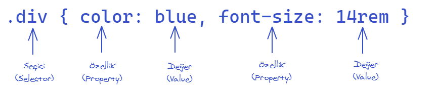

Tipik bir css yazımı aşağıdaki gibidir.

Temelde 3 öğe vardır. Bunlar

- Seçici (selector)
- Özellik (property)
- Değer (value)

olarak sınıflandırılabilir.

 ## Seçici

- İlgili css parçacığının HTML'de hangi öğelere uygulanacağını belirtir. Yukarıdaki örneğimizde html'de bulunan *div* öğelerine bu css uygulanacaktır.  

 ## Özellik

 - İlgili html parçacığının hangi özelliği css ile değiştirilecektir. Yukarıdaki örnekte *color* ve *font-size* özellikleri bu css ile değiştirilecektir. Yani *div*de bulunan yazıların rengi ve yazı boyutları bu css ile düzenlenmektedir. 

 ## Değer

 - İlgili html parçacığında seçilen özelliklerin değerlerini vermektedir. Yukarıdaki örnekte *color* yani *renk* olarak *blue* yani *mavi*, *yazı boyutu* olarak ise *14rem* verilmiştir. Burada bulunan *rem* bir ölçü birimidir. Ölçü birimleri [burada](./olcu_birimleri) detaylı anlatılmaktadır.